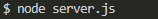
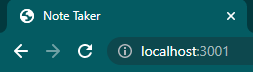
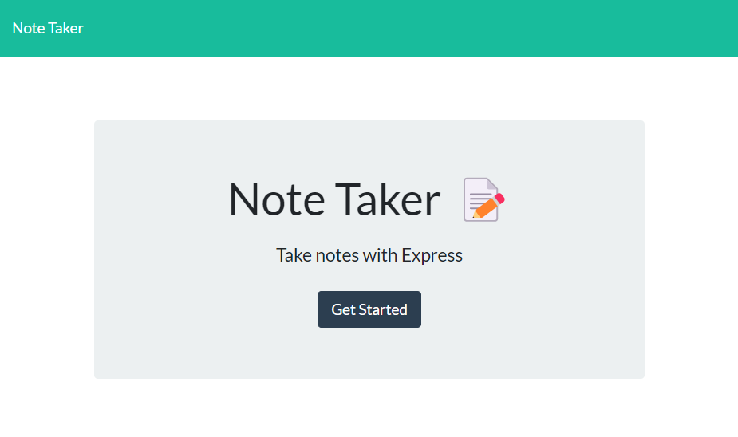
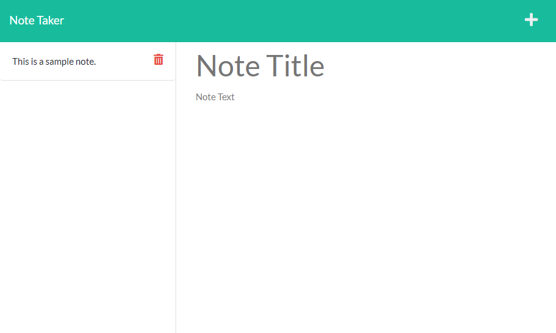

# Note Taker

## Description

- Motivation for this project: This application will help consolidate notes in an editable list.
- Reason for this project: We can all benifit from a consolidated note repository.
- Problem(s) solved by this project: This will keep notes in a central location.
- Lessons learned: I learned how to use Node Express using JavaScript to store/recall/edit/delete information.

## Table of Contents

- [Installation](#installation)
- [Usage](#usage)
- [License](#license)
- [Contributing](#contributing)
- [Bugs](#bugs)
- [Questions](#questions)

## Installation
Be sure to navigate to the Develop folder of the program.

In git bash, "npm i" should install all required Node modules to run the program.

## Usage
You can run the program in git bash with the command "node server.js".

You should be able to access the application by opening "localhost:3001" in your browser.

The main page should have a button to open the Notes page.

Notes can be added, reviewed, and deleted from the notes page.

## License

[MIT License](https://opensource.org/licenses/MIT)

## Contributing

If you have input to this application, please email me.

## Bugs

After a new note has been saved, the page has to be refreshed before the notes list on the left is populated with the new note. This is also the case after you select to delete a note.

## Questions

- [GitHub profile](https://www.github.com/Hostile131)
- [actuallysmart@yahoo.com](mailto:actuallysmart@yahoo.com)